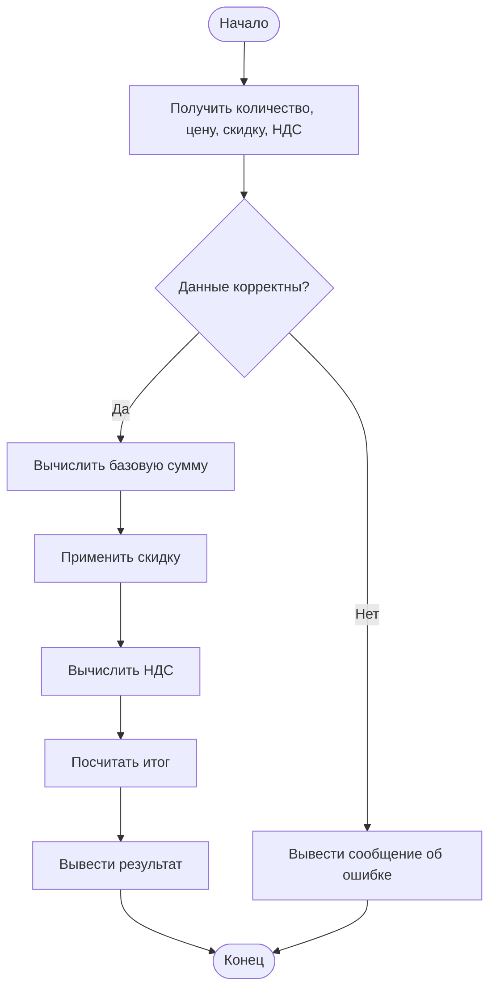

# Диаграммы проекта

## Activity-диаграмма для OrderCalculator

```mermaid
graph TD
    Start([Начало]) --> Input[Получить количество, цену, скидку, НДС]
    Input --> Check{Данные корректны?}
    Check -- Да --> CalcBase[Вычислить базовую сумму]
    CalcBase --> ApplyDisc[Применить скидку]
    ApplyDisc --> CalcVat[Вычислить НДС]
    CalcVat --> CalcTotal[Посчитать итог]
    CalcTotal --> Output[Вывести результат]
    Check -- Нет --> Error[Вывести сообщение об ошибке]
    Output --> End([Конец])
    Error --> End
```